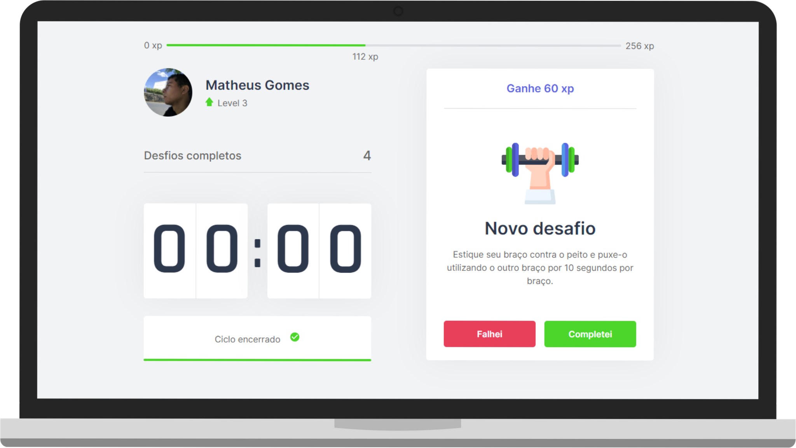

  

  <a href="#-tecnologias">Tecnologias</a>&nbsp;&nbsp;&nbsp;|&nbsp;&nbsp;&nbsp;
  <a href="#-projeto">Projeto</a>&nbsp;&nbsp;&nbsp;|&nbsp;&nbsp;&nbsp;
  <a href="#-layout">Layout</a>&nbsp;&nbsp;&nbsp;|&nbsp;&nbsp;&nbsp;
  <a href="#-licença">Licença</a>

  
  
       

  

 

<h1 align="center">
    
</h1>
 

## 📌 Tecnologias

Esse projeto foi desenvolvido utilizando as seguintes tecnologias:

- [Next.js](https://nextjs.org/)
- [React](https://reactjs.org)
- [TypeScript](https://www.typescriptlang.org/)

## 📌 Projeto

O Move.it te ajuda a sempre lembrar de exercitar-se! 🤸‍♂️ 

Projeto desenvolvido durante a **[Next Level Week](https://nextlevelweek.com/)**, que ocorreu durante os dias 22 a 28 de Fevereiro de 2021. 
Realizada pela **[@Rocketseat](https://github.com/Rocketseat)**.  
Trilha react liderada por  **[Diego Fernandes](https://github.com/diego3g)**.

## 🔖 Layout

Layout do projeto:

- [Layout Web](https://www.figma.com/file/ge20pu3ofMOKoliUyKx1Nl/Move.it-1.0) 

Será nescessário uma conta no [Figma](http://figma.com/) para acessá-lo.

## 📝 Licença

Esse projeto está sob a licença MIT. Veja o arquivo [LICENSE](LICENSE.md) para mais detalhes.
